PDFTextReader
===============

Tool to extract data from Diario Oficial da União (DOU) stored in PDF file.

# Architecture #
 
The project has a pipeline for processing the incoming PDF file.

## Problem: PDF has no concept of column, paragraph or line ##

PDF is just a collection of characters spread out in a document page. Sometimes we can tell that characters form a word due to its spacing characteristics. However, this spacing can be variable and breaks the word.

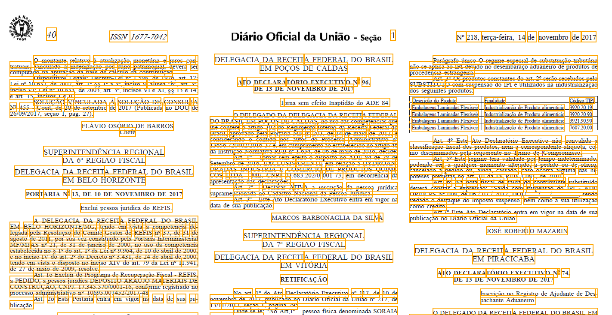

Examples:
- Por-t-aria (*correct: Portaria*)
- A-T-O DECLARA-TÓRIO (*correct: ATO DECLARATÓRIO*)
- CONSUL-T-A (*correct: CONSULTA*)

This block behavior brought us interesting surprises:

- Hidden characters to human (font size too small), but visible to machines
- Characters composed of multiple characters. Eg, Euro sign (€) is represented not as a Unicode, but with overlapped characters: `C` and `=`
- Characters in different sizes. Eg, ordinal number (Nº) is represented with `N`, `o`, `-` and it is read as `No-` by the machine. However, the `o` and `-` are printed with smaller fonts and higher baselines.


## Defining the Lines ##

The first problem was to find out when the characters are grouped into a single line. It is usually easy to tell that the characters are on the same baseline.

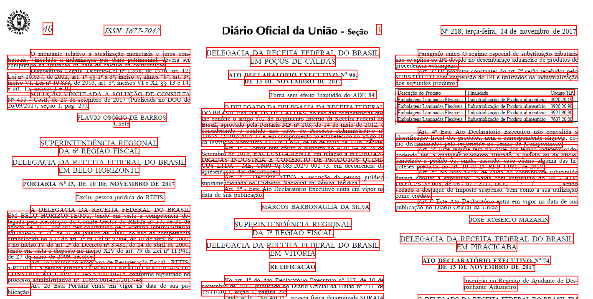

Major exceptions:
- Table rows (large spacing between the columns)
- Overlapped characters to represent a special character
- Multiple font sizes and types (eg, words in either bold and italic in the line - you cannot say that the line is all bold and italic)

## Identifying the Block Sets ##

The next step is to group the lines into block sets. We want to measure the distance between the lines, and have the closest lines forming a blockset. At least one blockset per column, but no blockset spans multiple columns.

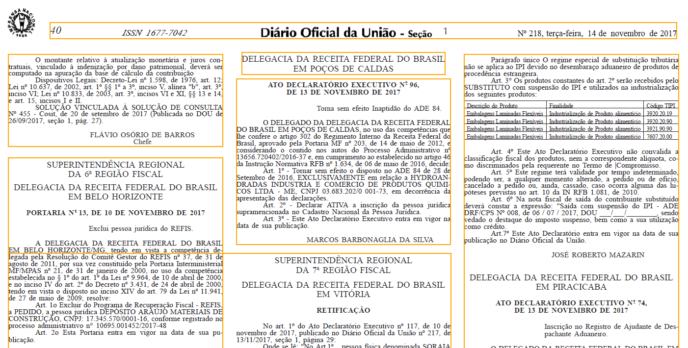

The image shows that sometimes we incorrectly classify the blocks. 

One of the most difficult task was to identify the Header and Footer of the page. There are multiple variations of header/footer in size and sometimes they are not present in the document. On the other hand, it is easy to check whether we correctly classified header/footer along the whole document.

Thus, analyzing headers and footers in the scope of a page is difficult. However, it is easy to analyze in the global scope of the document.


## PDF Printing Order ##

A file is a sequence of bytes that represents the characters and words of a PDF file. However, there is no high-level concept of lines, paragraphs or columns. We can say that PDF behaves more like a PostScript instruction set rather than a semantic HTML document. 

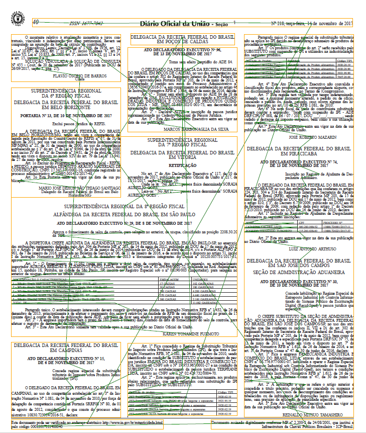

The characters and words are presented in no specific order. In our case study, we usually see the header and footer in the beginning of the file. But we also found exceptions to this.

The challenge is to identify what is a title or content (body). There is no explicit mark or tag to differentiate the content type. So we usually tell the title by the font size, the visual centered aligment and the upper case. Again, that is not a strict rule though.

There is no concept of tables or forms in PDF. Compared to HTML, there is no `<table><tr><td>` neither `<form><input type=..>`. We have only characters printed in front of a background image, which contains the grid lines.

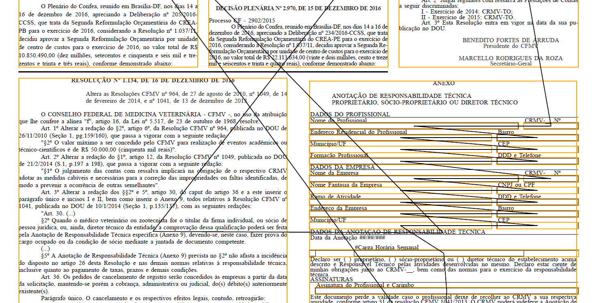

In order to reconstruct the tables, we have to parse all the line segments and glue them together. Then we have the concept of what is a rectangle, and then we look for text around and finally we have a table.


## Blockset Order ##

Once we understand what are text, image and tables, we can lay the blocks in the page. The last problem is to define the correct reading order - that is not simply left-right, up-down.

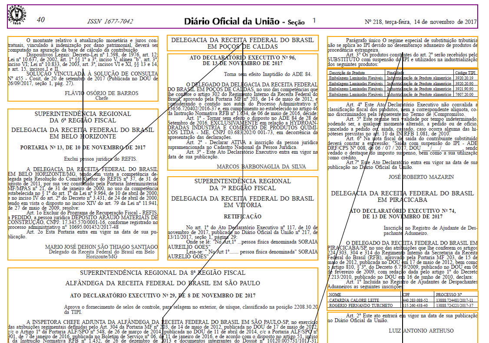

The problem is complex because a single page can have 1, 2 or 3 columns. Sometimes the columns can be merged, so it is not unusual to see a column fitting into a 2/3 of the page.


## Pipeline: PDF Parser ##

This initial process consists of a pipeline with ~30 stages. 

```csharp
pipeline.Input($"{inputfolder}/{basename}.pdf")
    .Output($"{outputfolder}/{basename}/parser-output.pdf")
    .AllPages<CreateTextLines>(page =>
                page.ParsePdf<PreProcessTables>()
                    .ParseBlock<IdentifyTables>()             // 1
                .ParsePdf<PreProcessImages>()
                    .ParseBlock<BasicFirstPageStats>()        // 2
                    .ParseBlock<RemoveOverlapedImages>()      // 3
                .ParsePdf<ProcessPdfText>()                   // 4
                    .ParseBlock<RemoveSmallFonts>()           // 5
                    .ParseBlock<MergeTableText>()             // 6
                    .ParseBlock<HighlightTextTable>()         // 7
                    .ParseBlock<RemoveTableText>()            // 8
                    .ParseBlock<ReplaceCharacters>()          // 9
                    .ParseBlock<GroupLines>()                 // 10
                    .ParseBlock<RemoveTableDotChar>()         // 11
                        .Show(Color.Yellow)
                        .Validate<RemoveHeaderImage>().ShowErrors(p => p.Show(Color.Purple))
                    .ParseBlock<RemoveHeaderImage>()          // 12
                    .ParseBlock<FindInitialBlocksetWithRewind>()  // 13
                        .Show(Color.Gray)
                    .ParseBlock<BreakColumnsLight>()          // 14
                    .ParseBlock<AddTableSpace>()              // 15
                    .ParseBlock<RemoveTableOverImage>()       // 16
                    .ParseBlock<RemoveImageTexts>()           // 17
                    .ParseBlock<AddImageSpace>()              // 18
                        .Validate<RemoveFooter>().ShowErrors(p => p.Show(Color.Purple))
                    .ParseBlock<RemoveFooter>()               // 19
                    .ParseBlock<AddTableHorizontalLines>()    // 20
                    .ParseBlock<RemoveBackgroundNonText>()    // 21
                        .ParseBlock<BreakColumnsRewrite>()    // 22

                    .ParseBlock<BreakInlineElements>()        // 23
                    .ParseBlock<ResizeBlocksets>()            // 24
                    .ParseBlock<ResizeBlocksetMagins>()       // 25
                    .ParseBlock<OrderBlocksets>()           // 26

                    .ParseBlock<OrganizePageLayout>()         // 27
                    .ParseBlock<MergeSequentialLayout>()      // 28
                    .ParseBlock<ResizeSequentialLayout>()     // 29
                        .Show(Color.Orange)
                        .ShowLine(Color.Black)

                    .ParseBlock<CheckOverlap>()               // 30

                        .Validate<CheckOverlap>().ShowErrors(p => p.Show(Color.Red))
                        .Validate<ValidatePositiveCoordinates>().ShowErrors(p => p.Show(Color.Red))
                    .PrintWarnings()
```

The current process is quite accurate (error: 1-2%). Most of the errors are caused by inline table. In order to improve this, we have to review our current process: 

1) Extract text
2) Identify the columns.

Thus, we have to first identify the blocksets and fit into columns. Then we extract the text and parse the tables.

1) Identify the columns.
2) Extract text

It looks similar - but it requires us to scan the PDF files twice.


## Defining the Text Alignment ##

The goal of the PDF Parser Pipeline is to generate a list of ordered blocksets that we can use to extract the text. The text itself has margins relative to the column (not to the page), which allow us to define the text alignment property.

In our case, we highlight the `centered text in red`, and `right-aligned or floating text in blue`.

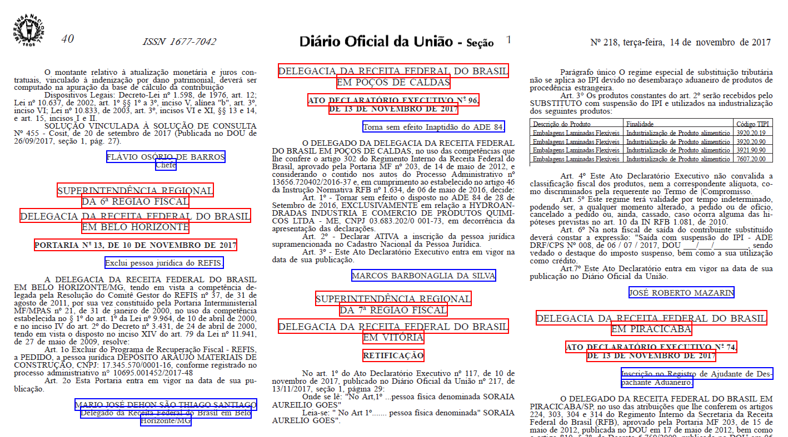


## Edge Cases are Hard ##

This process has also flaws:

1. Large vertical distance between the lines cause us to consider multiple paragraphs rather than a single one.

    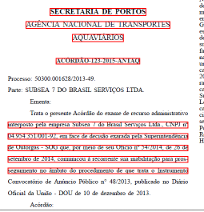


2. Titles and body text with similar vertical distance

    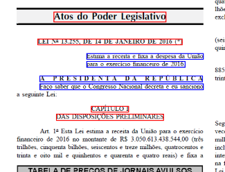


3. Justified text that are visually centered in the column

    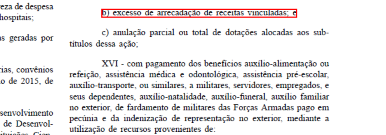


4. Centered text that are slightly off to the right, and could be considered as floating to the right

    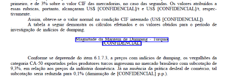


## Pipeline for Text Processing ##

Classifying the line into Centered, Justified or Floating-Right is quite straightforward. If the margins are equal, then the text is centered. If the margin right is smaller than the left, then it is floating left. Otherwise, it is justified.

However, we noticed several edge cases to be handled. The solution goes through the text to identify paragraph similarities to group them, and specific characteristics to break them apart. 

This process is composed of 7 stages.

```csharp
var articles = ConvertPdfIntoText(basename)
                .ConvertText<CreateTextLineIndex,TextLine>()        // 1
                .ConvertText<PreCreateStructures, TextLine2>()      // 2
                .ConvertText<CreateStructures2, TextStructure>()    // 3
                .ConvertText<PreCreateTextSegments, TextStructureAgg>() // 4
                .ConvertText<AggregateStructures, TextStructure>() // 5
                    .ShowPdf<ShowStructureCentral>($"{basename}-show-central.pdf")
                .ConvertText<CreateTextSegments, TextSegment>()     // 6
                .ConvertText<CreateTreeSegments, TextSegment>()     // 7
                .ToList();
``` 

## PDF Parser Result ##

The result is a Tree Segment with titles and articles found. 
This is the raw data from PDF file.

```
...
...
...
Ministério da Fazenda
    GABINETE DO MINISTRO
        DESPACHO DO MINISTRO
            Em 13 de novembro de 2017 (Page 24, ID=79)
    BANCO CENTRAL DO BRASIL
        PORTARIA Nº 95.519, DE 10 DE NOVEMBRO DE 2017 (Page 24, ID=80)
    COMISSÃO DE VALORES MOBILIÁRIOS
        DESPACHO DO DIRETOR
            Em 7 de novembro de 2017 (Page 24, ID=81)
    CONSELHO ADMINISTRATIVO DE RECURSOS FISCAIS
        2ª SEÇÃO 3ª CÂMARA 1ª TURMA ORDINÁRIA
            ATA DE JULGAMENTOS (Page 24, ID=82)
                7 DE NOVEMBRO DE 2017 A 9 DE NOVEMBRO DE 2017 (Page 24, ID=83)
        3ª SEÇÃO 2ª CÂMARA 1ª TURMA ORDINÁRIA
            PAUTA DE JULGAMENTOS (Page 25, ID=84)
    CONSELHO NACIONAL DE POLÍTICA FAZENDÁRIA
        ATO DECLARATÓRIO Nº 23, DE 13 DE NOVEMBRO DE 2017 (Page 35, ID=119)
        DESPACHOS DO SECRETÁRIO-EXECUTIVO
            Em 13 de novembro de 2017 (Page 36, ID=120)
        RETIFICAÇÃO (Page 36, ID=121)
    SECRETARIA DA RECEITA FEDERAL DO BRASIL
        INSTRUÇÃO NORMATIVA Nº 1.759, DE 13 DE NOVEMBRO DE 2017 (Page 36, ID=122)
        SUPERINTENDÊNCIA REGIONAL DA 1ª REGIÃO FISCAL ALFÂNDEGA DA RECEITA FEDERAL DO BRASIL NO AEROPORTO INTERNACIONAL DE BRASÍLIA- PRESIDENTE JUSCELINO KUBITSCHEK
            ATO DECLARATÓRIO EXECUTIVO Nº 256, DE 9 DE NOVEMBRO DE 2017 (Page 38, ID=123)
        DELEGACIA DA RECEITA FEDERAL DO BRASIL EM BRASÍLIA
            ATO DECLARATÓRIO EXECUTIVO Nº 92, DE 10 DE NOVEMBRO DE 2017 (Page 38, ID=124)
            ATO DECLARATÓRIO EXECUTIVO Nº 93, DE 10 DE NOVEMBRO DE 2017 (Page 38, ID=125)
        DELEGACIA DA RECEITA FEDERAL DO BRASIL EM GOIÂNIA
            ATO DECLARATÓRIO EXECUTIVO Nº 78, DE 13 DE NOVEMBRO DE 2017 (Page 38, ID=126)
            ATO DECLARATÓRIO EXECUTIVO Nº 79, DE 13 DE NOVEMBRO DE 2017 (Page 38, ID=127)
        SUPERINTENDÊNCIA REGIONAL DA 2ª REGIÃO FISCAL DELEGACIA DA RECEITA FEDERAL DO BRASIL EM SANTARÉM
            ATO DECLARATÓRIO EXECUTIVO Nº 4, DE 13 DE NOVEMBRO DE 2017 (Page 38, ID=128)
            ATO DECLARATÓRIO EXECUTIVO Nº 5, DE 13 DE NOVEMBRO DE 2017 (Page 38, ID=129)
            ATO DECLARATÓRIO EXECUTIVO Nº 6, DE 21 DE SETEMBRO DE 2017 (Page 38, ID=130)
            ATO DECLARATÓRIO EXECUTIVO Nº 7, DE 13 DE NOVEMBRO DE 2017 (Page 39, ID=131)
        SUPERINTENDÊNCIA REGIONAL DA 3ª REGIÃO FISCAL
            DELEGACIA DA RECEITA FEDERAL DO BRASIL EM SOBRAL
                ATO DECLARATÓRIO EXECUTIVO Nº 7, DE 1º DE NOVEMBRO DE 2017 (Page 39, ID=132)
        SUPERINTENDÊNCIA REGIONAL DA 4ª REGIÃO FISCAL DIVISÃO DE TRIBUTAÇÃO
            SOLUÇÃO DE CONSULTA Nº 4.045, DE 10 DE OUTUBRO DE 2017 (Page 39, ID=133)
            SOLUÇÃO DE CONSULTA Nº 4.046, DE 10 DE OUTUBRO DE 2017 (Page 39, ID=134)
        SUPERINTENDÊNCIA REGIONAL DA 6ª REGIÃO FISCAL DELEGACIA DA RECEITA FEDERAL DO BRASIL EM BELO HORIZONTE
            PORTARIA Nº 13, DE 10 DE NOVEMBRO DE 2017 (Page 40, ID=135)
        DELEGACIA DA RECEITA FEDERAL DO BRASIL EM POÇOS DE CALDAS
            ATO DECLARATÓRIO EXECUTIVO Nº 96, DE 13 DE NOVEMBRO DE 2017 (Page 40, ID=136)
        SUPERINTENDÊNCIA REGIONAL DA 7ª REGIÃO FISCAL DELEGACIA DA RECEITA FEDERAL DO BRASIL EM VITÓRIA
            RETIFICAÇÃO (Page 40, ID=137)
        SUPERINTENDÊNCIA REGIONAL DA 8ª REGIÃO FISCAL ALFÂNDEGA DA RECEITA FEDERAL DO BRASIL EM SÃO PAULO
            ATO DECLARATÓRIO EXECUTIVO Nº 29, DE 8 DE NOVEMBRO DE 2017 (Page 40, ID=138)
        DELEGACIA DA RECEITA FEDERAL DO BRASIL EM CAMPINAS
            ATO DECLARATÓRIO EXECUTIVO Nº 15, DE 6 DE NOVEMBRO DE 2017 (Page 40, ID=139)
        DELEGACIA DA RECEITA FEDERAL DO BRASIL EM PIRACICABA
            ATO DECLARATÓRIO EXECUTIVO Nº 74, DE 13 DE NOVEMBRO DE 2017 (Page 40, ID=140)
        DELEGACIA DA RECEITA FEDERAL DO BRASIL EM SÃO JOSÉ DOS CAMPOS SEÇÃO DE ADMINISTRAÇÃO ADUANEIRA
            ATO DECLARATÓRIO EXECUTIVO Nº 33, DE 10 DE NOVEMBRO DE 2017 (Page 40, ID=141)
        SUPERINTENDÊNCIA REGIONAL DA 9ª REGIÃO FISCAL DELEGACIA DA RECEITA FEDERAL DO BRASIL EM CURITIBA
            SERVIÇO DE ORIENTAÇÃO E ANÁLISE TRIBUTÁRIA EQUIPE DE ESTUDOS TRIBUTÁRIOS E BENEFÍCIOS FISCAIS
                ATO DECLARATÓRIO EXECUTIVO Nº 105, DE 10 DE NOVEMBRO DE 2017 (Page 41, ID=142)
        DELEGACIA DA RECEITA FEDERAL DO BRASIL EM FLORIANÓPOLIS
            ATO DECLARATÓRIO EXECUTIVO Nº 229, DE 13 DE NOVEMBRO DE 2017 (Page 41, ID=143)
            ATO DECLARATÓRIO EXECUTIVO Nº 230, DE 13 DE NOVEMBRO DE 2017 (Page 41, ID=144)
            ATO DECLARATÓRIO EXECUTIVO Nº 231, DE 13 DE NOVEMBRO DE 2017 (Page 41, ID=145)
            ATO DECLARATÓRIO EXECUTIVO Nº 232, DE 13 DE NOVEMBRO DE 2017 (Page 41, ID=146)
            ATO DECLARATÓRIO EXECUTIVO Nº 233, DE 13 DE NOVEMBRO DE 2017 (Page 41, ID=147)
        DELEGACIA DA RECEITA FEDERAL DO BRASIL EM JOAÇABA
            ATO DECLARATÓRIO EXECUTIVO Nº 55, DE 31 DE OUTUBRO DE 2017 (Page 41, ID=148)
    SUPERINTENDÊNCIA NACIONAL DE PREVIDÊNCIA COMPLEMENTAR
        DIRETORIA DE LICENCIAMENTO
            PORTARIA Nº 1.033, DE 31 DE OUTUBRO DE 2017 (Page 42, ID=149)
            PORTARIA Nº 1.053, DE 6 DE NOVEMBRO DE 2017 (Page 42, ID=150)
            PORTARIA Nº 1.059, DE 7 DE NOVEMBRO DE 2017 (Page 42, ID=151)
...
...
...            
```